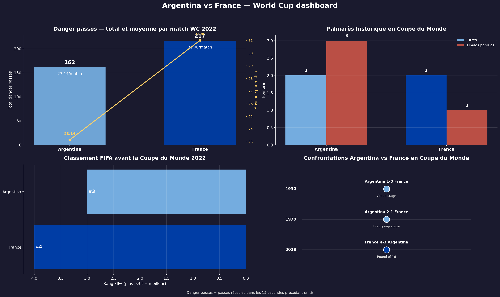
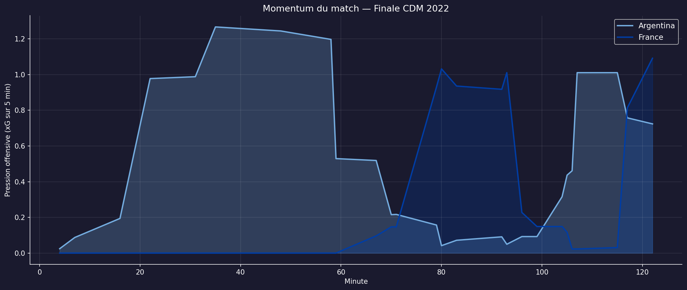

# Argentina vs France — World Cup Final 2022 Analysis

Data storytelling project on the **2022 FIFA World Cup Final** between **Argentina** and **France**, built with Python, Jupyter notebooks, football event data, and tactical visualizations.

The project combines:
- historical context before the final,
- data collection and preparation,
- team-level tactical analysis,
- player-level individual analysis.

The notebooks are written and commented in **French**, with a strong focus on making the analysis readable, coherent, and publishable.

## Project Goal

This project answers a simple question:

**How did Argentina control large parts of the final, and how did France still manage to come back into the match?**

The analysis explores:
- possession and ball circulation,
- shot volume and xG,
- pressing structure,
- passing networks,
- key player contributions,
- the tactical contrast between Argentina's **4-3-3** and France's **4-2-3-1**.

## Main Insights

- **Argentina controlled the structure of the game early**, with a denser passing network and a more connected midfield.
- **France's first phase was more fragmented**, with circulation relying more heavily on the back line and the flanks.
- **The French comeback was driven by game-state changes and substitutions**, especially in a more chaotic and vertical phase.
- **The player-level analysis confirms the team patterns**: Argentine midfielders were central to control, while France's most secure passing profiles were often deeper.

## Preview





## Repository Structure

```text
wc2022-analysis/
├── app/
│   └── streamlit_app.py
├── data/
│   ├── processed/
│   └── raw/
├── notebooks/
│   ├── 00_context_and_historical_background cld.ipynb
│   ├── 01_data_collection_and_preparation.ipynb
│   ├── 02_final_match_eda_and_tactical_overview.ipynb
│   └── 03_player_analysis  .ipynb
├── reports/
│   └── figures/
├── requirements.txt
└── README.md
```

## Notebooks

1. `00_context_and_historical_background cld.ipynb`  
   Historical background, head-to-head context, FIFA rankings, World Cup legacy, and offensive danger-pass comparison.

2. `01_data_collection_and_preparation.ipynb`  
   Data sourcing, filtering, loading, and preparation of the 2022 final event data.

3. `02_final_match_eda_and_tactical_overview.ipynb`  
   Match-level tactical analysis: xG, shots, pressure, recoveries, momentum, passing structure, and collective dynamics.

4. `03_player_analysis  .ipynb`  
   Individual analysis focused on player passing, dribbling, shots, pressure activity, movement zones, and tactical roles.

## Run The Project Locally

Install the dependencies:

```bash
pip install -r requirements.txt
```

Launch the future Streamlit app:

```bash
streamlit run app/streamlit_app.py
```

Open the notebooks:

```bash
jupyter lab
```

## Data Sources

- StatsBomb Open Data
- Complementary historical football datasets stored in `data/raw/`

## Project Status

- Notebook analysis: completed
- Markdown narration: completed
- GitHub portfolio setup: in progress
- Streamlit application: next step

## Why This Project

This repository is designed as a **portfolio project** combining:
- sports analytics,
- tactical reasoning,
- data visualization,
- notebook storytelling,
- and, next, an interactive Streamlit application.

## Next Step

The next milestone is to turn this notebook-based project into a **Streamlit application** that presents the final as an interactive story rather than a static set of notebooks.
